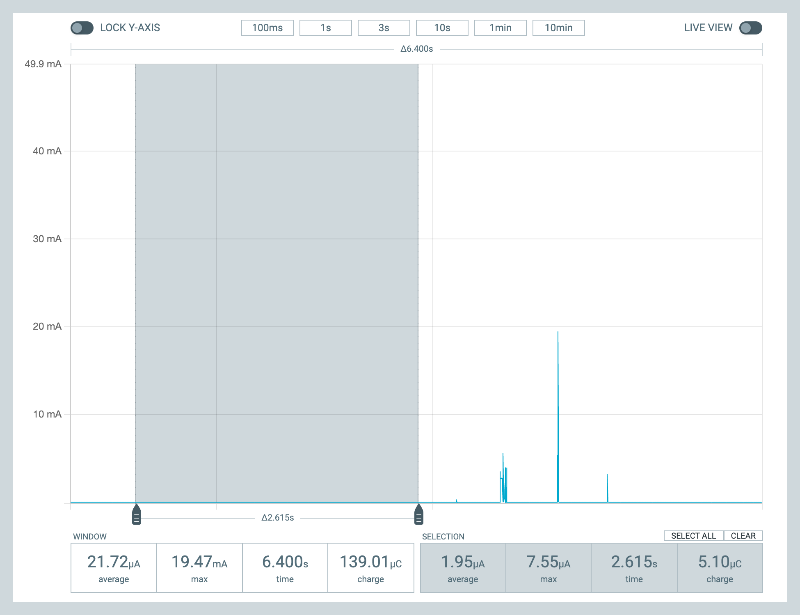
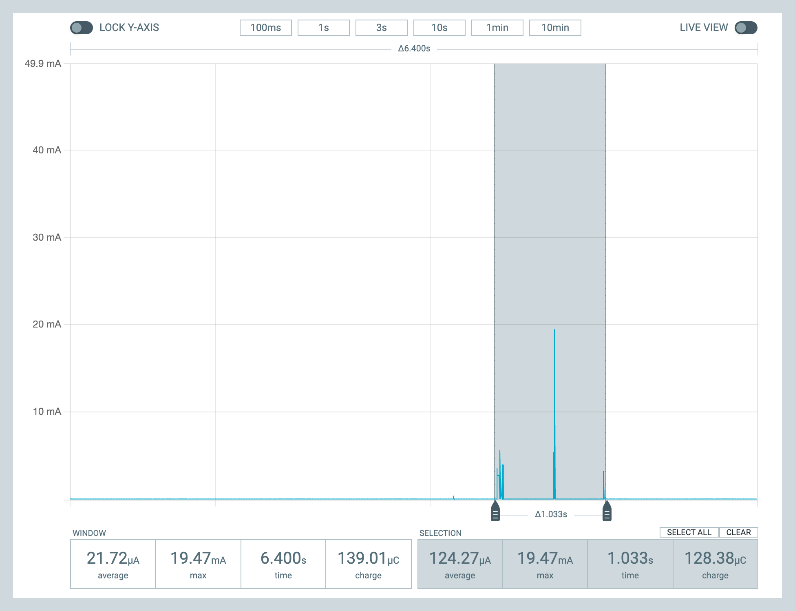

# Zigbee firmware sample
This sample is adapted from the [zigbee_template](https://developer.nordicsemi.com/nRF_Connect_SDK/doc/latest/nrf/samples/zigbee/template/README.html) from the nRF Connect SDK.

## Clusters
These [clusters](https://en.wikipedia.org/wiki/Zigbee#Cluster_library) are defined in the sample:

|Cluster ID|Name|
|--------|---|
|0x0001|Power Configuration|
|0x0400|Illuminance Measurement|
|0x0402|Temperature Measurement|
|0x0405|Relative Humidity Measurement|
|0x0408|Soil Moisture Measurement|

## Pairing Mode
The sample will first boot and start looking for a Zigbee coordinator - in pairing mode. The onboard LED will be flashing once a second while in this mode. Once a suitable network is found, the LED will briefly flash 3 times and remain off.

### Factory Reset
Most Zigbee devices provide a physical button to "factory reset" it - causing it to forget its joined network and look for a new one.

b-parasite has no physical buttons, and the implemented work around is to distinguish between two *reset modes*:
#### Power up mode
The device enters this mode when it is powered. For example, swapping an old battery or connecting to eternal power. This is the "usual" reset mode, and joined networks will be remembered.

#### Reset pin mode
If the device's RESET pin is briefly grounded, the device will effectively be **factory reset**. The device will leave its previous network and start looking for a new one.

## Configs
Available options in `Kconfig`. Notable options:
* `CONFIG_PRST_ZB_SLEEP_DURATION_SEC`: amount of time (in seconds) the device sleeps between reading all sensors and updating its clusters
* `CONFIG_PRST_ZB_PARENT_POLL_INTERVAL_SEC`: amount of time (in seconds) the device waits between polling its parent for data

## Zigbee2MQTT & Home Assistant
This firmware sample has only been tested with [Zigbee2MQTT](https://zigbee2mqtt.io/), an open source Zigbee bridge that [connects seamlessly with Home Assistant](https://github.com/zigbee2mqtt/hassio-zigbee2mqtt).

The [b-parasite.js](b-parasite.js) file contains a converter that can be installed to Zigbee2MQTT to suppoort this sample. See [Support new devices](https://www.zigbee2mqtt.io/advanced/support-new-devices/01_support_new_devices.html) for instructions.

## Battery Life
While sleeping, the device consumes around 2 uA:

In the active cycle, it averages around 370 uA for 2.6 seconds:

